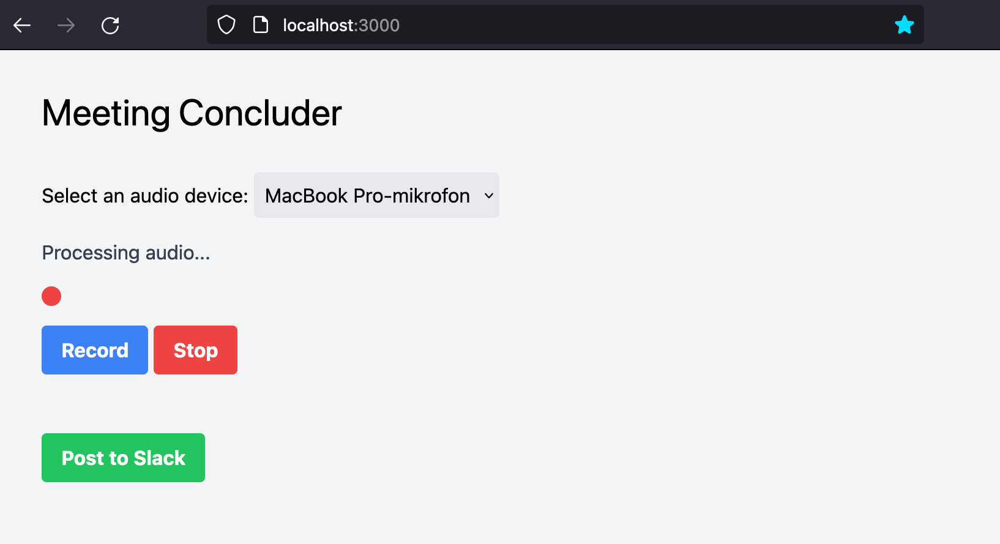

# Hackday Meeting Concluder

This application can record and then summarize meetings automatically. The summary and conclusion can optionally be sent to a Slack channel of your choosing.

## Screenshot



## Getting started

* Install the required dependencies (portaudio, ffmpeg and Go 1.16 or later).
* Configure your Slack web hook URL either as the `SLACK_EBHOOK_URL` environment variable, or as `slack_webhook = "YOUR SLACK WEBHOOK URL GOES HERE"` in `~/.config/concluder.toml`.
* Configure your OpenAI API Key either as the `OPENAI_API_KEY` or `OPENAI_KEY` environment variable, or as `openai_api_key = "YOUR KEY GOES HERE"` in `~/.config/concluder.toml`.
* Make sure that you have a working microphone.

Clone the repository and run the server (which includes a frontend):

```sh
git clone  https://github.schibsted.io/alexander-fet-rodseth/hackday-meeting-concluder.git
cd hackday-meeting-concluder
cd cmd/backend/backend
go build -mod=vendor
./backend
```

Then visit `http://localhost:3000`.

A double clap can be used to stop the recording.

## Project contents

* A Go package named `concluder`.
* A web server with REST endpoints and a web frontend.
* Several command line utilities, which were used for testing.

## Utilities

* `cmd/rec/rec` was used for recording `cmd/rec/output.wav` which contains is a recording of me saying `This meeting is about creating a llama farm.`.
* `cmd/wav2mp4/wav2mp4` was used for converting `cmd/rec/output.wav` to `cmd/wav2mp4/output.mp4`.
* `cmd/audio2text/audio2text` was used for converting `cmd/wav2mp4/output.wav` to `cmd/audio2text/output.txt`.
* `cmd/conclude/conclude` was used for converting `cmd/audio2text/output.txt` to `cmd/conclude/output.txt`.
* `cmd/slackpost/slackpost` was used for posting `cmd/conclude/output.txt` to `#nmp-meeting-concluder` on Slack.
* `cmd/meetingconcluder/meetingconcluder` records, converts, transcribes, concludes and posts to Slack.
* `cmd/play/play` can play wav files, buy requires the `afplay` command.

## General info

* Version: 1.0.1
* Author: Alexander F. Rødseth
* License: Apache2
